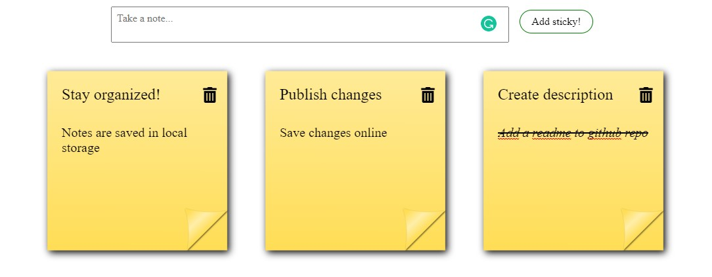

# Notes-app

This is a simple note taking app. It creates notes in the form of sticky notes and stores them in local storage. Built with Vanilla JS.

## Overview

### The features

- Create a new note (error message if no content is added to text part of the note)
- strike-through by double click
- edit notes
- delete notes

### Screenshot

### Links

- Solution URL: [Notes app](https://vilmis04.github.io/Notes-app)

## My process

### Built with

- HTML
- CSS
- JavaScript

## Author

- Github - [vilmis04](https://github.com/vilmis04)
- LinkedIn - [Vilmantas Sudaris](https://www.linkedin.com/in/vilmantas-sudaris-63567586)
